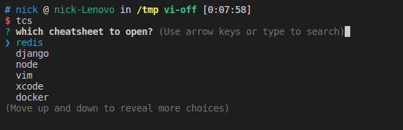

# terminal-cs
show cheatsheets in terminal for lookup convenience.

# Install
```bash
$ npm install -g terminal-cs
```

# Usage
```bash
$ tcs
```


### How to add your own cheatsheets
In order to have `tcs` index your own cheatsheets, just copy them to `~/.cheatsheets/entries`.
> You can also go to https://github.com/LeCoupa/awesome-cheatsheets for some awesome cheatsheets.

# LICENSE
MIT
